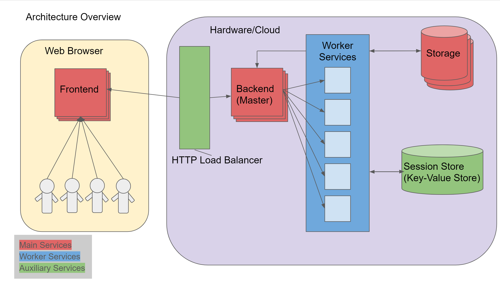

## PeerPresents 2019 Design Document ##
A Web-Based System for In-Class Peer Feedback during Student Presentations

### Context

Peer feedback systems enable students to get feedback without substantially burdening the instructor. However, current systems typically ask students to provide feedback after class; this introduces challenges for ensuring relevant, timely, diverse, and sufficient amounts of feedback, and reduces the time available for student reflection. PeerPresents is a novel system for in-class peer review where students can quickly exchange feedback on projects without being burdened by additional work outside of class. We found students can receive immediate, copious, and diverse peer feedback through a structured in-class activity. Students also described the feedback they received as helpful and reported that they gave more feedback than without using the system. These early results demonstrate the potential
benefits of in-class peer feedback systems.

### Overview

### Stakeholders

* Students presenting their work
* Students giving feedback to peers
* Course Staff or Instructors
* Researchers using data

### Goals

#### Overall Goals

* Support stakeholder goals
* Scale horizontally to support user growth
  * I.e. microservice architecture
* Target platforms
  * (Server): Flexible deployment (compatible with cloud platforms and on-premise machines)
  * (App): Desktop and mobile web-browsers

#### Stakeholder Goals

* Students Presenting
  * Share content with entire team
  * Write questions to influence feedback they get
  * Direct crowd to questions (ensure they receive feedback)
  * View all feedback their team received
  * Reflect on feedback individually and/or as a team (organization, sorting, visualizing)
* Students giving feedback
  * Give feedback to multiple teams in one session
    * Switch between presentations
  * Give feedback (answer presentor’s questions)
  * View other students’ feedback
  * Reaction to other students’ feedback (vote/emoji/etc)
  * No threaded discussion
* Course Staff / Instructors
  * How many students are online
  * How many students are active (watching, commenting, reacting)
  * Quality check on feedback students are giving
  * May want to give feedback themselves
  * Want to know something about the reflection process
  * Want system to handle all the logistics
  * Turn features on/off for presentations
* Researchers
  * Group presentations in a study or in a study condition
  * Easily extract data by study
  * Have system capture all relevant data
  * Turn features on/off for particular groups of students
    * A/B Testing

### Proposed Solution

**Components:**

* Frontend (User Interface)
  * Handles all user interactions
  * Routes requests to appropraite microservice
* Backend Master (Server)
  * Handles all requests from Frontend
  * Assigns tasks to appropriate Worker Services
* Storage
  * Handles all database requests
* Session Store
  * Persists session state externaly to microservices and main storage
* Worker Services (dynamically provisioned workers; process light-weight tasks)
  * Identity Service
    * Handles user auth and user management
  * Presenter Service
    * Handles configuration of Presentations
  * Live Presentation Service
    * Handles connections for live presentation sessions
    * Generates URL for live presentation
  * Listener Service
    * Handles all Listener interactions
      * Respond, Upvote, React
  * Research Data Service
    * Handles accessing data for research interests

**User Stories:**

* Presentation Setup
  * As a Presenter, I can ...
    * create a Presentation
    * submit Questions for my Presentation
    * view and share a unique URL for my Presentation
* During Presentation
  * As a Listener, I can ...
    * join a Presentation with a provided URL
    * see all Questions and Responses
    * submit Responses to Questions
    * Upvote a Response
    * React to a Response
* Reflection / Post-Mortem
  * As a Presenter, I can ...
    * view all Responses in my Presentation
    * view all Response Metadata
    * Tag a Response
    * React to a Response
    * Sort/Filter Responses by Tags

**Architecture:**

Follows a microservice architecture. The user interacts exclusively through the Frontend. The Frontend sends all requests to the Backend Master (1 or more servers). If using more than 1 Backend Master, a simple load balancer can be used. The Backend Master recieves all incoming Frontend requests and assigns tasks to the appropriate Worker Service. Worker Services process light-weight tasks and can be provisioned on-the-fly by the Backend Master.

### Existing Solution

The [twerp repository](https://github.com/creativecolab/twerp) contains the existing solution for PeerPresents (2017). This solution has the following components and is described through user stories below.

**Components:**

* Frontend (Client web page)
  * User Interface
  * Javascript App
* Backend (Server)
  * Handles all requests from Frontend
  * Node.js App
* Storage
  * Contains all application and user data
  * MySQL database hosted by remote service (Linode)

**User Stories:**

* Presentation Setup
  * As a Presenter, I can ...
    * create a Presentation
    * submit Questions for my Presentation
    * view and share a unique URL for my Presentation
* During Presentation
  * As a Listener, I can ...
    * join a Presentation with a provided URL
    * see all Questions and Responses
    * submit Responses to Questions
    * Vote on a Response
    * Emoji react to a Response
* Reflection / Post-Mortem
  * As a Presenter, I can ...
    * view all Responses in my Presentation
    * view all Response Metadata
    * Tag a Reponse
    * Sort/Filter Responses by Tags

**Architecture:**

Follows a monolithic server architecture. The user interacts exclusively through the Frontend. The Frontend sends all requests to a single Backend server. The Backend server processes all incoming Frontend requests and sends responses back to the Frontend. Frontend requests cause interactions (read/write) with Storage. A Session Store is used to persist session state in the distributed architecture.

### Solution Comparison

Existing solution cons:
* Slows as number of users increases (need for scalability)
* Codebase has become disjoint. Leads to difficulty adding new features without introducing bugs.

Existing solution pros:
* Could be deployed quickly
* Works in small-scale scenarios
* Fulfills most design requirements

Proposed solution cons:
* Requires engineering effort to complete
* The microservice architecture (provides scalablity) is more complex than the existing solution

Proposed solution pros:
* Scales horizontally (add more instances to handle more users)

### Milestones
See the Project Plan document for milestones.

### Testability, Monitoring, and Alerting

**Unit Tests**
Unit tests will be written for all components continuously during development. A component must pass all unit tests before being accepted into the master branch.

**Functional Tests**
Functional tests will be written for all components continuously during development. A component must pass all functional tests before being accepted into the master branch.

**Monitoring**
Any system/component actively running on non-development resources must be monitored with periodic health checks. The monitoring results must be stored in an aduitable format in a secure location. 

### Open Questions

